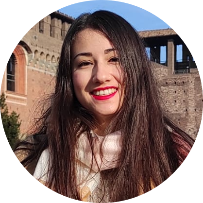

# Tiziana Tocci Personal Website - Welcome here!

 

  
   

      Hello, I am Tiziana Tocci, a PhD Candidate at Institut Curie.   
      I am a young researcher enthusiastic about subjects at the interface between biology and informatics. 
      I am currently conducting my doctoral project at Institut Curie, under the supervision of Hervé Isambert and Pascal Hersen. 
      By using novel causal discovery algorithms developed in the Isambert laboratory, our aim is to unconver the causal-effect relationships that govern            the complex         biological systems under study. 
      Specifically, I analyze cell microscopy videos and single cell transcriptomics data in order to extract features/variables of interest and uncover the         association         and causality between these properties. 
      I am inclined to work in scientific international environments and to participate into the organization of scientific events (member of the Young              Researchers' Seminars committee of my research unit). 
  

## 📂 Sections

[🎓 Education](education)  
[👩‍🎓 Work Experience](work)  
[📝 Publications](publications)  
[🎤 Presentations](presentations)  
[📚 Courses: self-teaching](courses)  
[📬 Contacts](contacts)  
